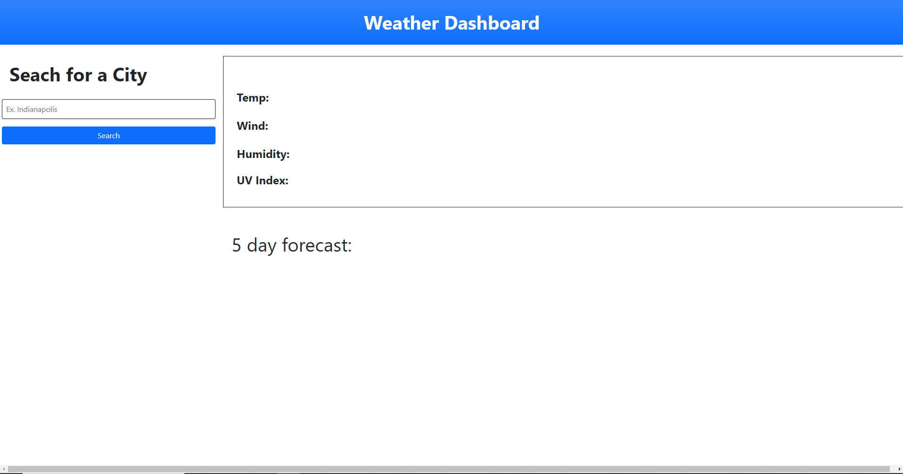

# Weather-dashboard

[github link to my weather dashboard](https://github.com/Drewpayton/Weather-dashboard)

[link to my weather dashboard](https://drewpayton.github.io/Weather-dashboard/)

# Description

Search your city or a city of choice and it will display the weather and the five day forecast of the city

# Instructions 
Type in the search bar the city you want to know the forecast for and then you hit the search button then it shows the current temp, wind in mph, humidity, and uv index for that day and the next five days are forecasted below. As well it keeps track of your history.

